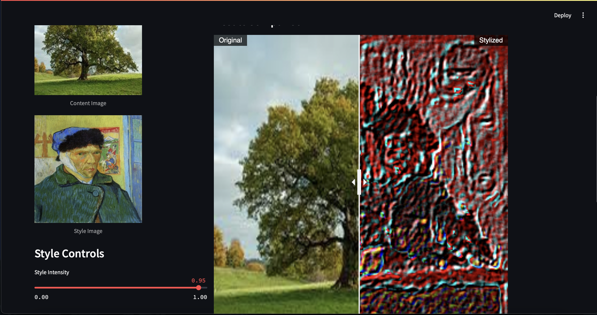
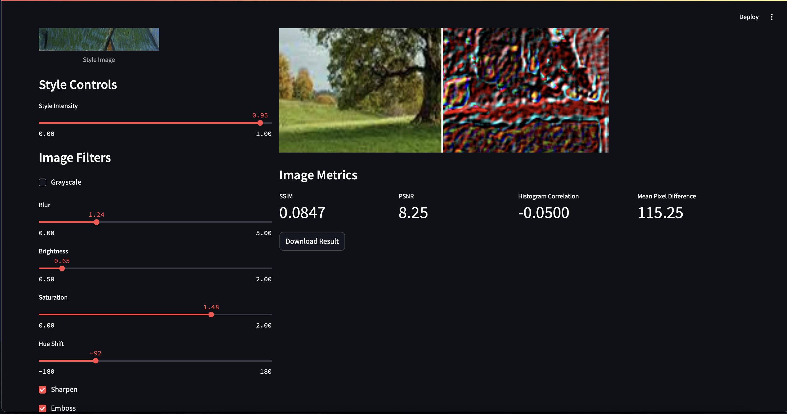
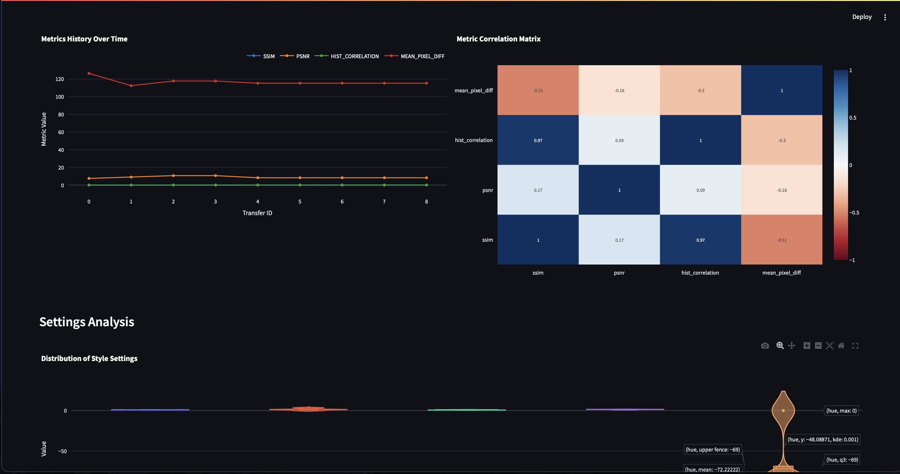

Welcome to Style Transfer Lab! Check it out [here](https://image-styler.streamlit.app).

The content image is the image you wish to modify. The style image is the image whose distinct features you want within the content image. For example, applying the style of Vincent van Gogh onto a photo of a tree results in...

You have numrous controls over how 'much' of the style is applied on the image and how much you want the image modified in the first place anyways. You can see the controls here:

Of course, that's not all. View metrics that show the differences (and similarities) between your original and generated image, and even see changes over time as you style more and more images.

Any questions? Submit a PR or chat with me on Slack!